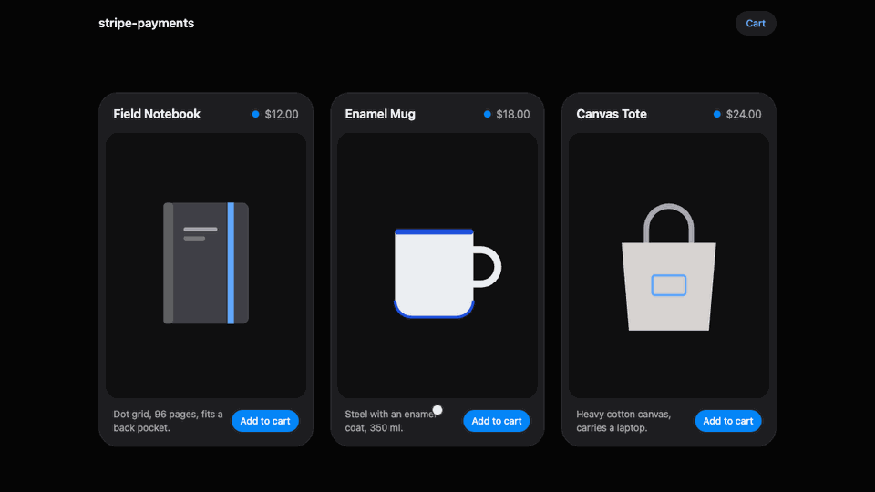

# stripe-payments

A small shop on Stripe Checkout: a React storefront with a cart, a NestJS API and PostgreSQL. The interesting part is not taking the payment but learning about it. Stripe tells the shop through webhooks, and webhooks break in four ways: the signature does not match, the same event arrives twice, events arrive out of order, or an event never arrives. Each of the four is handled in the code and reproduced by a test.



## Quickstart

Prerequisites: Node 22+, Docker and a Stripe account (the sandbox is enough, no business verification). The Stripe CLI runs in a container, nothing to install.

```sh
# 1. PostgreSQL in Docker (host port 5434)
docker compose up -d

# 2. Backend config
cp apps/backend/.env.example apps/backend/.env
#    STRIPE_SECRET_KEY: Dashboard -> Developers -> API keys, sandbox (sk_test_...)

# 3. Webhook signing secret; paste the printed whsec_... into STRIPE_WEBHOOK_SECRET
npm run stripe:secret

# 4. Frontend config
cp apps/frontend/.env.example apps/frontend/.env

# 5. Install, migrate + seed three products
npm install
npm run db:reset

# 6. Two terminals: webhooks forwarded to localhost, and the apps
npm run stripe:listen
npm run dev
```

Open http://localhost:4000, add something to the cart and pay with the test card `4242 4242 4242 4242`, any future date, any CVC. The order page switches from pending to paid when the webhook lands.

Tests need only the Docker database, not Stripe or the network:

```sh
npm test
```

## How it works

```
storefront   cart
             POST /checkout
               │
API          order: pending
             sessions.create
               │
Stripe       Checkout page
             customer pays
               │
               ├── redirect to /orders/:id
               │   storefront polls the order
               │
               └── POST /webhooks/stripe  (checkout.session.*)
                   API verifies the signature,
                   records the event id once,
                   moves the status forward only

API          reconcile job, every minute
             sessions.retrieve
             for orders still open
```

- `apps/backend/src/checkout/checkout.service.ts` prices the order from the database, never from the request, and opens the session with an idempotency key per order.
- `apps/backend/src/webhooks/webhooks.service.ts` verifies, deduplicates and applies events.
- `apps/backend/src/orders/order-status.ts` is the whole state machine: the moves an order may make.
- `apps/backend/src/orders/reconcile.service.ts` asks Stripe about orders nobody told us about.
- `packages/contracts` holds the Zod schemas both apps share.

## Four places webhooks break

**1. Signature.** Stripe signs the exact bytes it sends. Most frameworks parse JSON before your handler runs, and serializing it back gives a different string, so the check fails on every real event. The app is created with `rawBody: true` and the handler verifies `req.rawBody`. Test: `apps/backend/test/signature.e2e.spec.ts`: a re-serialized body and a forged signature are both rejected, nothing is written.

**2. Duplicates.** Stripe delivers an event at least once, sometimes more. Every event id is inserted into `StripeEvent` in the same transaction as the order change; a second copy finds the id and does nothing. Two copies arriving at the same moment are serialized by the primary key. Test: `apps/backend/test/duplicates.e2e.spec.ts`.

**3. Order.** Stripe does not keep events in order. With a delayed payment method `checkout.session.completed` (unpaid) is followed by `async_payment_succeeded`, and the second can overtake the first. Order status only moves forward, and the move is a single `UPDATE … WHERE status IN (…)`, so a late event has nowhere to go. Test: `apps/backend/test/ordering.e2e.spec.ts`.

**4. Missed events.** An endpoint that is down longer than Stripe retries (three days in live mode, a few hours in a sandbox) never hears about the payment. A reconcile job reads the Checkout Session of every order still open after `RECONCILE_AFTER_SECONDS` and applies the same state machine. Test: `apps/backend/test/missed.e2e.spec.ts`.

## What is deliberately not here

- **No accounts.** Anyone with an order id can see that order.
- **No refunds, shipping or tax.** Checkout Session supports all three; they add screens, not webhook problems.
- **No live mode.** The backend refuses to start with a key that is not `sk_test_`.
- **No retry queue.** A failed event handler returns 500 and Stripe retries it; the reconcile job covers the rest.

## Author and license

Built solo by Nikita MRCS — [@nmrcs](https://github.com/nmrcs). Every design
decision, every number and every mistake in this repository is mine.

MIT.
